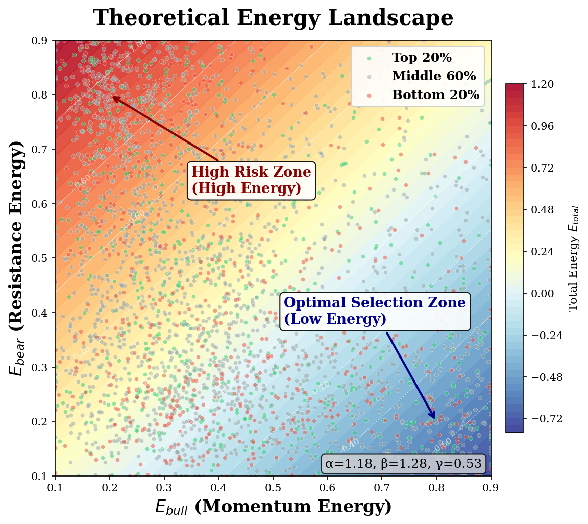
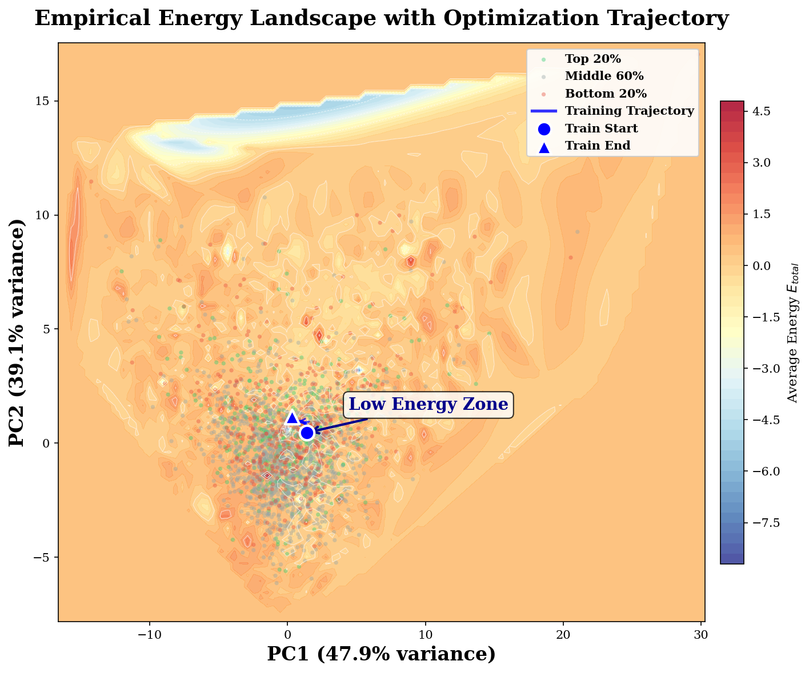

<div align="center">

# PRIME: Beyond Black Boxes
### An Energy-Based Unified Framework for Interpretable Stock Selection

**P**otential **R**obust **I**ntegrated **M**acro **E**nergy

[](LICENSE)
[](https://www.python.org/)
[](https://pytorch.org/)
[](https://kdd.org/)

*Code release for the KDD 2026 submission.*
[English](README.md) · [中文说明](README_CN.md)

</div>

---

## Overview

Quantitative stock selection from large-scale market data is central to achieving
excess returns, yet a persistent challenge is **tail risk** — rare events that
trigger non-stationary regime shifts, invalidate learned patterns, and distort
portfolio logic. Most deep-learning approaches are black boxes that neither model
*how* tail events reshape market dynamics nor offer interpretable tools to navigate
them.

**PRIME** grounds return generation and tail-risk control in **energy-based modeling**
and **game theory** from a momentum perspective:

- A **semantic encoder** decomposes market forces into *bullish momentum*,
  *bearish resistance*, and *frictional dissipation*, casting stock valuation as an
  **energy state** within a long–short game.
- A **macro-aware modulation** mechanism reshapes the energy landscape across
  bull–bear transitions via learned coefficients (α, β, γ), adapting the scoring
  geometry to tail-driven non-stationarity.
- The **aggregation** is formulated through **potential game theory**, whose Nash
  equilibrium properties provide stable ranking under distributional shift.
- A **Risk Guardian** module closes the loop, detecting anomalous energy spikes as
  crash signals and filtering them from portfolio construction.

Experiments on **S&P 500** and **CSI 500** benchmarks (with extensive ablations)
show PRIME achieving roughly a **10% improvement over state-of-the-art baselines**,
backed by theoretical guarantees on convergence and ranking consistency.

> **Interpretability.** By transforming black-box prediction into a potential
> function, energy minimization lets investors attribute each selection to *strong
> momentum*, *weak resistance*, or *low market friction*.

<div align="center">


<br>
<em>Left: theoretical energy landscape in (E<sub>bull</sub>, E<sub>bear</sub>) space — top-ranked
stocks cluster in the low-energy basin. Right: empirical energy dynamics on real data.</em>
</div>

---

## Key contributions

1. **Energy-based feature encoding** — transforms black-box predictions into an
   interpretable energy decomposition for principled stock selection.
2. **Macro-state modulation** — energy-semantic modulation that dynamically adapts
   selection logic to macroscopic economic regimes (bull / neutral / bear).
3. **Theoretical guarantees** — maximum-entropy derivation of the Gibbs
   distribution, pairwise-learning tractability, ranking-consistency convergence,
   bounded-energy design, and optimization convergence at rate *O(1/T)*.

---

## Method at a glance

PRIME is trained as a four-stage pipeline. The architecture is unchanged across
markets — only the market profile (presets, costs, feature semantics) differs.

| Stage | Name | What it does |
|:-----:|------|--------------|
| **1** | Sanity Check | Validates features / labels and warms up the encoder. |
| **2** | Game EBM ranking | Learns the energy decomposition and pairwise ranking under the potential-game objective. |
| **3** | Risk Guardian | Mines hard crash cases and trains a GBDT crash filter on the model's blind spots. |
| **4** | Integrator + Backtest | Combines ranking + guardian into a portfolio and runs a cost-aware backtest. |

**Feature decomposition (44 features in 4 semantic groups):**

```
Bull  (16) ─ momentum, RSI, capital inflow, growth, chip support …  → E_bull   (momentum)
Bear  (10) ─ valuation rank, bias, trapped ratio, resistance …      → E_bear   (resistance)
Frict ( 9) ─ turnover, volatility, amplitude, cost dispersion …     → E_friction
Macro ( 9) ─ CPI, PPI, PMI, rates, market vol/liquidity …           → α, β, γ modulation
```

The same 44-dimensional structure is reused for **ETFs** via a semantic field
remapping (e.g. *capital inflow → fund-flow*, *chip support → share growth*), so the
`GameEnergyModel` needs no architectural change to switch asset classes.

---

## Repository structure

```text
prime_kdd_2026/
├── README.md / README_CN.md      # documentation (EN / 中文)
├── LICENSE                       # MIT
├── requirements.txt
├── CITATION.cff
├── prime/                        # ── source code ──────────────────────────
│   ├── main.py                   # unified CLI entry point
│   ├── config.py                 # Config / Feature / Training / Backtest configs
│   ├── market_profiles.py        # market presets (CSI500 / SP500 / Nikkei / STOXX)
│   ├── data_loader.py            # data pipeline + market-aware mock generator
│   ├── dataset.py                # StockDataset / PairwiseDataset / loaders
│   ├── trainer.py                # 4-stage training orchestration
│   ├── backtest.py               # cost-aware portfolio backtester
│   ├── experiment_runner.py      # main / ablation / robustness experiments
│   ├── experiment_catalog.py     # experiment registry
│   ├── integrity_check.py        # one-command end-to-end smoke check
│   ├── visualization.py          # all paper figures & diagnostics
│   ├── models/                   # energy_model · risk_guardian · losses
│   └── baselines/                # 10 baselines (LSTM … TIME-LLM, DeepTrader)
├── data/
│   ├── README.md                 # data format, sourcing & mock-data policy
│   └── example/                  # small synthetic example panels (schema demo)
├── figures/                      # curated paper figures (+ supplementary/)
└── scripts/                      # one-line reproduction scripts
```

> **Data policy.** This repository ships **no proprietary financial data**. It
> contains code, configuration, a small **synthetic example dataset**, paper
> figures, and reproduction scripts. When real data is absent, PRIME
> **auto-generates market-aware mock data** so every command runs out-of-the-box.
> See [`data/README.md`](data/README.md).

---

## Installation

```bash
git clone https://github.com/XXXiaoNick/prime_kdd_2026.git
cd prime_kdd_2026

# (recommended) create an isolated environment
python -m venv .venv && source .venv/bin/activate    # or: conda create -n prime python=3.10

pip install -r requirements.txt
```

`torch` is the only heavy dependency; a GPU is optional but recommended for full
training. `lightgbm` is optional — the Risk Guardian falls back to a scikit-learn
classifier if it is missing (install it for exact paper reproduction).

---

## Quick start

All commands are run from the repository root; the package lives in `prime/`.

```bash
# 0) Sanity check the whole system end-to-end (fast, uses auto-generated mock data)
python prime/integrity_check.py --quick --skip_baselines

# 1) Train + backtest PRIME on CSI 500 stocks (auto-mock data if none present)
python prime/main.py --mode train --market_profile csi500 --asset_type stock --fast

# 2) Same on S&P 500
python prime/main.py --mode train --market_profile sp500  --asset_type stock --fast

# 3) ETF mode
python prime/main.py --mode train --market_profile csi500 --asset_type etf   --fast

# 4) Backtest a saved checkpoint
python prime/main.py --mode backtest --checkpoint outputs/checkpoints/<run_name>
```

**Using your own data** (optional): drop a panel at
`data/<market>/panel/panel_data_complete.parquet` (or `.csv`), or point anywhere via
`--data_root /abs/path` or the `PRIME_DATA_ROOT` environment variable. See
[`data/README.md`](data/README.md) for the expected schema (the example panels in
`data/example/` are a ready-made template).

---

## Reproducing the paper

```bash
# Main experiments (market suite, ETF generalization, cross-geography, case study)
bash scripts/run_main_experiments.sh

# Ablation studies (module / feature-grouping / aggregation / guardian)
bash scripts/run_ablation.sh

# Robustness studies (noise / top-k / lr / epochs / crash-label / rolling window …)
bash scripts/run_robustness.sh

# Baselines (LSTM, ALSTM, GRU, Transformer, PatchTST, GPT4TS, TIME-LLM, AlphaStock, DeepTrader)
bash scripts/run_baselines.sh
```

Each script wraps `python prime/main.py --mode <...>`. Inspect the registries with:

```bash
python prime/main.py --list_main_experiments
python prime/main.py --list_ablations
python prime/main.py --list_robustness
python prime/main.py --list_baselines
```

Outputs (metrics, NAV curves, holdings, checkpoints, figures) are written under
`outputs/` and `outputs_baselines/`, which are git-ignored by design.

---

## Figures

The figures used in the paper are reproduced in [`figures/`](figures/) (PNG + vector
PDF), with a full mapping to paper figure numbers in
[`figures/README.md`](figures/README.md):

| Paper figure | Content |
|---|---|
| Fig. 1 | Theoretical energy landscape in (E<sub>bull</sub>, E<sub>bear</sub>) space |
| Fig. 3 | Game phase space & Risk-Guardian discriminability |
| Fig. 4 | Empirical energy dynamics (PC1–PC2 projection, correlation matrix) |
| Fig. 5 | Regime-dependent energy landscapes (bull / neutral / bear) |
| Fig. 6 | Regime-dependent energy correlations |
| Fig. 7 | Computational-efficiency analysis (A10 GPU) |

Ablation, robustness, and learning-curve figures are in
[`figures/supplementary/`](figures/supplementary/).

---

## Markets & baselines

**Markets** (presets in `prime/market_profiles.py`): `csi500`, `sp500`, `nikkei225`,
`stoxx600` — each with its own trading windows, costs, and mock-data style.
**Asset types**: `stock`, `etf`.

**Baselines** (`prime/baselines/`): Market Index, LSTM, ALSTM, GRU, Transformer,
PatchTST, GPT4TS, TIME-LLM, AlphaStock, DeepTrader.

---

## Citation

If you find this work useful, please cite (anonymized for review):

```bibtex
@inproceedings{prime2026,
  title     = {Beyond Black Boxes: An Energy-Based Unified Framework for Interpretable Stock Selection},
  author    = {Anonymous},
  booktitle = {Proceedings of the 32nd ACM SIGKDD Conference on Knowledge Discovery and Data Mining (KDD)},
  year      = {2026}
}
```

See also [`CITATION.cff`](CITATION.cff).

---

## License

Released under the [MIT License](LICENSE). The code is provided for research and
educational purposes. **No investment advice** is implied; nothing here is a
recommendation to trade any security.
